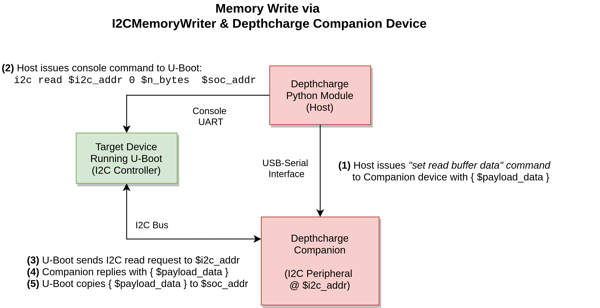

.. _fw:

Companion Firmware
==============================

Overview
--------

The *Depthcharge Companion Firmware* extends the toolkit's vantage point 
of a target beyond that of exposed serial consoles and unauthenticated non-volatile
storage contents, and into a position of a peripheral device attached to
a simple serial bus.  From here, one can seek to violate any assumptions made
about the size, structure, and content of data originating from a peripheral device.
(Refer to sections 4.3 and 5 of the `TPM Genie whitepaper`_ for some
related inspiration in a different context.) 

Additionally, a *Depthcahrge Companion* can be used as a proxy for moving data between
the target and the host. The following figure depicts the use of this firmware
to perform a memory write operation on a target, via
:py:class:`~depthcharge.memory.I2CMemoryWriter`.

Currently, only I2C support is provided. SPI support is envisioned in the
future, pending a platform that demonstrates a good (ab)use-case for it.
`Ethernet controller management`_ and `utility commands`_ are potential examples
of sufficiently "dangerous" console commands.

.. _TPM Genie whitepaper: https://github.com/nccgroup/TPMGenie/blob/master/docs/NCC_Group_Jeremy_Boone_TPM_Genie_Whitepaper.pdf
.. _Ethernet controller management: https://gitlab.denx.de/u-boot/u-boot/-/blob/master/drivers/net/e1000.c#L5825
.. _utility commands: https://gitlab.denx.de/u-boot/u-boot/-/blob/master/drivers/net/pfe_eth/pfe_cmd.c#L495

Implementation
--------------

This firmware is intended to run on simple, low-cost devices and be readily
accessible to newcomers. Thus, the current implementation targets the 
`Teensy 3.6`_ development board, leveraging the `Teensyduino`_ add-ons to the
standard `Arduino`_ environment.

To simplify portability to additional platforms, all core functionality is
implemented in a `Depthcharge`_ library.  Platform-specific (``.ino``) source files
can then use this library with just a few operations, summarized below.

1. Initialise the (USB) serial interface used to communicate with the host.
2. Instantiate a ``Depthcharge::Companion`` instance
3. Attach the desired ``Serial``, ``Wire`` (I2C), and LED instaces to the
   ``Depthcharge::Companion`` instance.
4. Enable interrupts.
5. Call ``Depthcharge::Companion::processEvents()`` in the main loop.

.. _Teensy 3.6: https://www.pjrc.com/store/teensy36.html
.. _Teensyduino: https://www.pjrc.com/teensy/teensyduino.html
.. _Arduino: https://www.arduino.cc/en/Main/Software
.. _Depthcharge: https://github.com/nccgroup/depthcharge/tree/main/firmware/Arduino/Depthcharge

Below is the source code for the Teensy 3.6 implementation, which demonstrates the above.

.. literalinclude:: ../../firmware/Arduino/Depthcharge-Teensy3.6/Depthcharge-Teensy3.6.ino
    :language: cpp

Command Set
----------------------------

The host code (:py:class:`depthcharge.Companion`) communicates with
*Depthcharge Companion* firmware using a simple binary "type-length-value"
(TLV) message format:

* Command type: 1 byte
* Length of following payload:  1 byte - unsigned, may be zero
* Data payload: Command-specific data, if any. (Omitted with length field is zero.)

Below are the supported commands. Device responses follow the same TLV format, with any
response data being included in the *Data payload*.

+--------------------------------+-------------------------------------------------------------+
| Command                        | Description                                                 |
+================================+=============================================================+
| 0x00: FW_GET_VERSION           | Query the Companion's firmware version.                     |
|                                | The device responds with 4 bytes of version information,    |
|                                | each of which represents an unsigned integer value.         |
|                                |                                                             |
|                                | * Byte 0: Major version                                     | 
|                                | * Byte 1: Minor version                                     |
|                                | * Byte 2: Patch version                                     |
|                                | * Byte 3: "Extra" version information. Defaults to 0.       |
|                                |                                                             |
+--------------------------------+-------------------------------------------------------------+
| 0x01: FW_GET_CAPABILITIES      | Query the Companion's capability flags. The device returns  |
|                                | these flags as little-endian uint32_t. Bit 0 is asserted to | 
|                                | denote that I2C functionality is supported.                 |
+--------------------------------+-------------------------------------------------------------+
| 0x02-0x07: FW_RESERVED         | Reserved for future firmware/device attributes.             |
+--------------------------------+-------------------------------------------------------------+
| 0x08: I2C_GET_ADDR             | Query the I2C address that the device is currently          |
|                                | responding to. The device responds with a either a 1-byte   |
|                                | address in the range of 0x00-0x7f or an error code.         |
|                                | The device defaults to an address of 0x78.                  |
+--------------------------------+-------------------------------------------------------------+
| 0x09: I2C_SET_ADDR             | Set the device's I2C peripheral address to the specified    |
|                                | 1-byte value. Address must be in 0x00-0x7f. The device      |
|                                | responds with a 1-byte SUCCESS or error code.               |
+--------------------------------+-------------------------------------------------------------+
| 0x0a: I2C_GET_SPEED            | Query I2C bus speed the device is configured for. The       |
|                                | device responds with either a little-endian uint32_t        | 
|                                | (4 byte) value in Hz, or a 1-byte error code.               |
|                                | The device defauls to 100 kHz (100,000 Hz).                 |
+--------------------------------+-------------------------------------------------------------+
| 0x0b: I2C_SET_SPEED            | Set the device's I2C bus speed, specified as a 4-byte       |
|                                | little-endian uint32_t value in Hz. The device will respond |
|                                | with a 1-byte SUCCESS or error code.                        |
+--------------------------------+-------------------------------------------------------------+
| 0x0c: I2C_GET_SUBADDR_LEN      | Query the number of I2C subaddress bytes that should be     |
|                                | ignored. (The default is 1.) The device either responds     |
|                                | with a 1-byte length in 0x00-0x7f or an error code.         |
+--------------------------------+-------------------------------------------------------------+
| 0x0d: I2C_SET_SUBADDR_LEN      | Set the number of I2C subaddress bytes that should be       |
|                                | ignored, as a 1-byte value in 0x00-0x7f. The device will    |
|                                | respond with a 1-byte SUCCESS or error code.                |
+--------------------------------+-------------------------------------------------------------+
| 0x0e-0x0f I2C_RESERVED         | Reserved for future I2C commands.                           |
+--------------------------------+-------------------------------------------------------------+
| 0x10: I2C_SET_READ_BUFFER      | Set the data that the Companion will provide when the       |
|                                | target device performs an I2C read from it. If the provided |
|                                | data exceeds the size of the firmware's read buffer, it     |
|                                | will be truncated. The device responds with either a 1-byte |
|                                | SUCCESS or error code.                                      |
+--------------------------------+-------------------------------------------------------------+
| 0x11: I2C_GET_WRITE_BUFFER     | Retrieve the data written by the target platform to the     |
|                                | Companion device over I2C. The device responds with the     |
|                                | most recent write data, or a 1-byte error code.             |
+--------------------------------+-------------------------------------------------------------+
| 0x12-0x1f I2C_RESERVED         | Reserved for future I2C commands.                           |
+--------------------------------+-------------------------------------------------------------+
| 0x20-0x2f: SPI_RESERVED        | Reserved for SPI functionality.                             |
+--------------------------------+-------------------------------------------------------------+
| 0x30-0x7f: RESERVED            | Reserved for future functionality.                          |
+--------------------------------+-------------------------------------------------------------+
| 0x80-0xff: NEIGHBOR_RESERVED   | Reserved for customization by All Good Neighbors.           | 
|                                | Upstream code will not allocate new commands here.          |
+--------------------------------+-------------------------------------------------------------+

Below are error codes returned by the firmware.

+--------------------------------+-------------------------------------------------------------+
| Error Code                     | Description                                                 |
+================================+=============================================================+
| 0x00: SUCCESS                  | Operation completed successfully.                           |
+--------------------------------+-------------------------------------------------------------+
| 0xff: INVALID_CMD              | An invalid command identifier was provided.                 | 
+--------------------------------+-------------------------------------------------------------+
| 0xfe: NOT_SUPPORTED            | Requested functionality is not supported by device or is    |
|                                | not available in the current operating mode.                |
+--------------------------------+-------------------------------------------------------------+
| 0xfd: INVALID_PARAM            | The submitted requested included an invalid parameter       |
|                                | (in data field).                                            |
+--------------------------------+-------------------------------------------------------------+
| 0xfc: UNINITIALIZED            | An attempt was made to use functionality before it was      |
|                                | configured or initialized.                                  |                   
+--------------------------------+-------------------------------------------------------------+
| 0xfb: UNIMPLEMENTED            | Requested functionality is reserved and incomplete or       |
|                                | "stubbed" out.                                              |
+--------------------------------+-------------------------------------------------------------+
| 0xfa-0xf0: RESERVED            | Reserved for future error codes.                            |
+--------------------------------+-------------------------------------------------------------+
