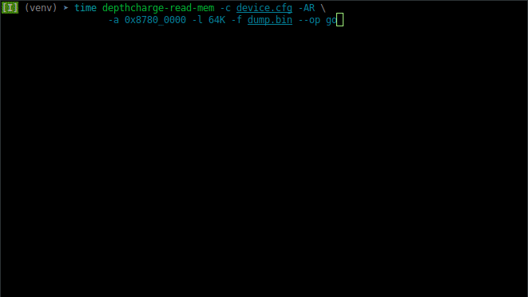
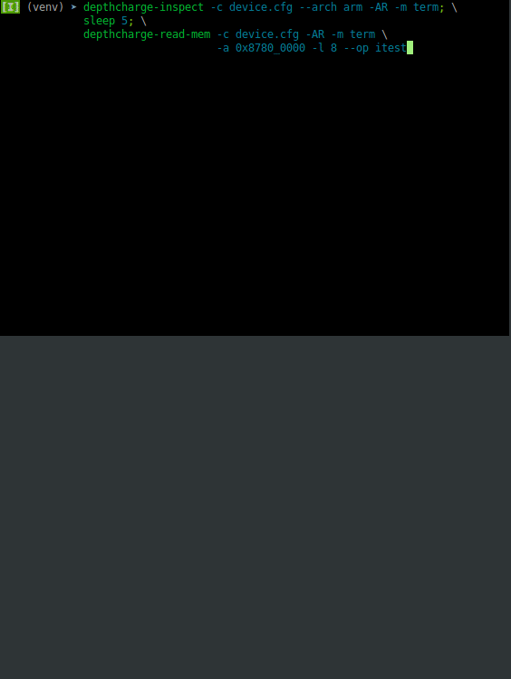

.. _introduction:

Introduction
============

What is Depthcharge?
--------------------

Depthcharge is a toolkit designed to support security research and
"jailbreaking" of embedded platforms using the `Das U-Boot`_ bootloader,
herein referred to only as *"U-Boot"*.

This toolkit consists of:

* An extensible :ref:`Python 3 module <api>`
* :ref:`scripts` built atop of the Depthcharge Python module
* "Depthcharge :ref:`fw`", which is used to perform attacks requiring a malicious peripheral device.
* Some example `"helper" payload binaries`_ and build scripts to get you started with U-Boot `"standalone" program`_-esque payloads.

The Depthcharge source code and releases can be found at:

.. centered:: https://github.com/nccgroup/depthcharge

.. _Das U-Boot: https://www.denx.de/wiki/U-Boot
.. _"helper" payload binaries: https://github.com/nccgroup/depthcharge/tree/main/payloads
.. _"standalone" program: https://gitlab.denx.de/u-boot/u-boot/-/blob/v2020.01/doc/README.standalone

Why did we create this?
-----------------------

The first steps in hunting for remotely exploitable, high impact
vulnerabilities in an embedded system-based target is often to first extract
non-volatile storage contents for analysis, and then achieve privileged access
(e.g. a root shell) on a device in order to perform further testing and analysis.
U-Boot's attack surface and breadth of functionality frequently make both
readily available through local and physical attacks. While exciting
to us hardware hackers, these types of attacks attacks generally
pose less risk to "regular" users of consumer devices that are not left
unattended or carried around in one's pocket. (*Your system's threat model may
vary, of course!*) In this sense, attacking a system's (vendor-modified) U-Boot
bootloader is often just a neccessary first step towards getting a closer look
at a system' custom application software operating along attack surface boundaries.

Security professionals operate under limited time frames and budgets. Tools that
allow us to standardize our methodologies and work more efficiently
ultimately allow us to do a more thorough job in identifying and reporting
vulnerabilities that could harm users -- specifically those that be both
high-impact and remotely exploitable. Depthcharge was born out of necessity, in
situations where approaches like simple `fault injection`_ during NV storage
access or `device-specific environment modifications`_ weren't possible or fruitful.
Specifically, we've encountered a number of devices in which a product vendor
or OEM attempted to restrict access to the U-Boot console, as well as prevent
modification of boot-time code and data through the use of "*secure boot*" (or
"*authenticated boot"*) implementations, such as `NXP's HABv4`_.

In many of these situations, a reduced-functionality console was
still present and contained a handful of seemingly harmless standard or
vendor-added console commands. However, some commands, such as `i2c` and
`crc32` can be (ab)used as **memory write-what-where primitives** to achieve
arbitrary code execution within U-Boot, compromising the chain of trust well
before the OS has had a chance to boot. This provides us with a powerful
vantage point, from which we can leverage to more fully explore a platform. The
abuse of commands as arbitrary memory read operations (e.g. `setexpr`,
`itest`), while not as immediately useful as their write counterparts, allow a
platform's (vendor-modified) U-Boot code to be retrieved for further
inspection.

After repeatedly creating one-off proof-of-concept scripts leveraging the
same bags of tricks, we finally decided that we needed something that would
allow us to iterate more quickly, and with a consistent methodology. Thus, we
sought to create a framework of reusable building blocks and common operations.

Finally, given that U-Boot is `licensed under GPL v2.0`_, consumers have the
right to request and review modified U-Boot source code from their product
vendors. These tools are also intended to support those wishing to exercise
their `right to repair, tinker with, and re-use`_ the products that they own.
Just because a product vendor is no longer running web services, shipping
fixes, or distributing security patches for a product, does a perfectly good
piece of hardware need to become e-waste. Go forth, `upcycle`_, and breathe new life
info those old gadgets!

.. _fault injection: https://media.defcon.org/DEF%20CON%2024/DEF%20CON%2024%20presentations/DEF%20CON%2024%20-%20Brad-Dixon-Pin2Pwn-How-to-Root-An-Embedded-Linux-Box-With-A-Sewing-Needle-UPDATED.pdf
.. _licensed under GPL v2.0: https://www.denx.de/wiki/U-Boot/Licensing
.. _right to repair, tinker with, and re-use: https://www.eff.org/issues/right-to-repair
.. _device-specific environment modifications: https://colinoflynn.com/2016/07/getting-root-on-philips-hue-bridge-2-0
.. _NXP's HABv4: https://www.nxp.com/docs/en/application-note/AN4581.pdf
.. _upcycle: https://hackaday.com/tag/upcycle

Will this be useful for my situation?
--------------------------------------

If you have access to a restricted U-Boot `console`_, can tamper with
a stored `environment`_, or modify a loaded `script`_, Depthcharge may be the
right tool for the job!

Otherwise, you may still find that the abstractions included in the Depthcharge
API (e.g. :py:class:`~depthcharge.Operation`, :py:class:`~depthcharge.Stratagem`,
:py:class:`~depthcharge.hunter.Hunter`) provide a suitable framework and
foundation for building your own U-Boot attack automation and image analysis
tools. We very much have intended this API to be a tool for quickly iterating
on new ideas and one-off scripts.  Take a gander at the underlying
implementation of :ref:`cmd`, :ref:`env`, and :ref:`fdt` for
examples of U-Boot image analysis use cases.

Many vendors ship production firmware containing highly permissive U-Boot
configurations that are directly inherited from `upstream defaults`_ intended
for development kits and reference design platforms. In this case, you can
likely achieve what you want without Depthcharge, but it can definitely be
useful if you're looking to automate interactions with the U-Boot
:py:class:`console <depthcharge.Console>`. Read on!

.. _console: https://gitlab.denx.de/u-boot/u-boot/-/blob/v2020.01/doc/README.console
.. _environment: http://www.denx.de/wiki/view/DULG/UBootEnvVariables
.. _script: https://www.denx.de/wiki/DULG/UBootScripts
.. _Operation: ./python/depthcharge/operation.py
.. _Stratagem: ./python/depthcharge/stratagem.py
.. _Hunter: ./python/depthcharge/hunter.py
.. _depthcharge-stratagem: ./python/scripts/depthcharge-stratagem
.. _depthcharge-cmd-table: ./python/scripts/depthcharge-cmd-table
.. _upstream defaults: https://gitlab.denx.de/u-boot/u-boot/-/tree/v2020.01/configs

What are some of its key features?
----------------------------------

Below are some highlights of Depthcharge's current functionality.

.. _intro_api:

Python API
~~~~~~~~~~

The :doc:`Depthcharge Python API </api/index>` is the primary focus of this
project. This API strives to be a **"tool for quickly scripting U-Boot hacks"** 
rather than an *automagic exploitation framework for U-Boot*. While one
can certainly seek to build this atop of Depthcharge, this is not the primary
goal of the project. Given that OEMs and product vendors all introduce their
own modifications to U-Boot, this API favors common security testing "building
blocks" over collecting "one-off" device-unique exploits.

Convenience Scripts
~~~~~~~~~~~~~~~~~~~

A collection of :doc:`/scripts/index` allow one to leverage key API functionality through
simple command-line interfaces. In many cases, users may need only these scripts and
otherwise never need to write a line of Python code.  That being said, familiarity
with the API allows one to leverage the maximum benefit from these scripts, as well
as build custom tooling atop of Depthcharge.

Memory Access Abstractions
~~~~~~~~~~~~~~~~~~~~~~~~~~

When platform vendors attempt to prune "dangerous" general-purpose memory
access operations from U-Boot console support (rather than remove this functionality entirely),
less obvious security-impacting memory access mechanisms (e.g., *i2c*, *crc32*,
*itest*, *setexpr*) may be overlooked, leaving opportunities to read or
modify running code. This can be especially perilous in situations where
investments have been made in an attempt to put a SoC's "secure boot"
functionality to use, as memory-access mechanisms can be exploited to
undermine the chain of trust.

Depthcharge identifies a variety of memory access operations and provides
an abstraction atop of them. This makes it easier to automate boot-time tasks
and proof-of-concept exploitation examples, regardless of which specific
operations you're (ab)using. Based upon the available functionality and the
size of a requested data read/write, it will attempt to select the "best"
available operation. (You still have control to specify which implementation is
used and how, of course.)

This abstraction is exposed via:

* Scripts: :ref:`read` and :ref:`write`
* API calls: :py:meth:`Depthcharge.read_memory() <depthcharge.Depthcharge.read_memory>` and
  :py:meth:`Depthcharge.write_memory() <depthcharge.Depthcharge.write_memory>`

Note that the :ref:`built-in memory access operations <apimemimpl>` are only the tip of the iceberg.
If you `search for the U_BOOT_CMD macro`_ in both the upstream U-Boot source
repository, as well as the forks maintained by various silicon vendors and OEMs,
you'll find that there many more potential candidates that can be added.
(We are of course, happy to accept pull requests for functionality we can reproduce
on specified platforms or development kits!)

If you encounter a memory access command that's not the in the
Depthcharge codebase, note that you can register your own
:py:class:`~depthcharge.memory.MemoryReader` or
:py:class:`~depthcharge.memory.MemoryWriter` implementation at runtime using the
API via the static :py:meth:`Operation.register() <depthcharge.Operation.register>`
class method.

.. _search for the U_BOOT_CMD macro: https://gitlab.denx.de/search?search=U_BOOT_CMD&project_id=531&search_code=true&repository_ref=v2020.04

Improved Memory Dumping
~~~~~~~~~~~~~~~~~~~~~~~

Given access to a permissive U-Boot console, a common approach for dumping
(storage contents copied to) memory is to use an `md-based approach <https://github.com/gmbnomis/uboot-mdb-dump>`_.

However, this tends to be slow, considering that the data is formatted as a hex
dump, and may take hours when leveraging this approach to extract flash contents.
When the *go* command is available, a simple binary `memory read payload`_
can be deployed and used instead, which is generally much faster.

Although there's overhead in deploying an executable payload, it only needs to be done
once per power-on, and becomes negligible for larger memory dumps (i.e., on the order
of MiB). The speed difference between the *md* and the *go* with a custom payload approach is
apparent in the below examples. Note that the second time the *go*-based read is performed, the
``-D`` option is used to skip re-deployment of the payload, further reducing the run time.

.. _memory read payload: https://github.com/nccgroup/depthcharge/blob/main/payloads/src/read_memory.c

And yes, we too know the tragic pain of losing hours due to an accidentally interrupted, long running memory dump.
Memory read operations are neighborly and will return data read so far, when interrupted. This is shown below.
(Here the ``-f, --file`` option is omitted so that the partial data is more evident when displayed as a hex dump.)

Data Structure Identification
~~~~~~~~~~~~~~~~~~~~~~~~~~~~~

Depthcharge can identify the following data structures, provided with a memory or flash dump.

Built-in or stored environments
^^^^^^^^^^^^^^^^^^^^^^^^^^^^^^^

The ability to identify and tamper with (unauthenticated) environment variables
(e.g. via offline modification of flash memory) can allow arbitrary commands to be
executed within the pre-boot environment, even in situations where an
interactive console is inaccessible.

The :ref:`env` script can be used to identify and extract environment data from
a memory dump, including the following metadata:

* Whether the environment is...

  * a built-in default
  * a stored environment 
  * or a stored redundant environment (See `CONFIG_SYS_REDUNDAND_ENVIRONMENT`_)

* The environment's CRC32 checksum
* The corresponding ``CONFIG_ENV_SIZE`` - the total (padded) size that CRC32 checksum is computed over
* The "flags" word used to denote which environment is active, in the case of redundant environments

When viewing the environment contents in their text form, Depthcharge can optionally expand variable definitions.
This can make life a little bit easier in those cases where *bootcmd* and
friends are defined as a function of a dozen other variables.

For more information, see :py:class:`~depthcharge.hunter.EnvironmentHunter`.

.. _CONFIG_SYS_REDUNDAND_ENVIRONMENT: https://gitlab.denx.de/u-boot/u-boot/-/blob/v2020.04/env/Kconfig#L394

Command tables
^^^^^^^^^^^^^^

If a device does not appear readily expose a command console, it can be very
useful to determine if any tables command handlers (including their name,
function pointers, and help text) are present in the binary.  If so, this may
indicate that access is gated based upon some input, whether it be a standard
`AUTOBOOT`-based "stop string", a simple IO pin state, or a cryptographic
challenge-response mechanism. (Just knowing what a vendor has included in their
build is half the battle!)

.. _AUTOBOOT: https://gitlab.denx.de/u-boot/u-boot/-/blob/v2020.04/doc/README.autoboot#L116

Furthermore, the presence of multiple unique command tables can suggest that a
platform vendor has implemented different operating modes or authorization
levels. This is the case demonstrated in our `blog post`_, where we show how
this type of table can be patched to expose "hidden" commands.

.. _blog post: https://research.nccgroup.com/2020/07/22/depthcharge

Depthcharge's :ref:`cmd` script (built atop of :py:class:`~depthcharge.hunter.CommandTableHunter`) can be used to locate these
command tables. Below is an abridged example excerpt, when run with the ``--detail`` argument.

.. code-block:: text

    Command table @ 0x8ff684bc (file offset 0x000684bc) - 308 bytes, 11 entries
       CONFIG_SYS_LONGHELP=True, CONFIG_AUTO_COMPLETE=True
   
       ...
   
      [7] @ 0x8ff68580
            name: nboot
         maxargs: 4
         cmd_rep: 0x00000001
             cmd: 0x8ff6502c
        complete: 0x00000000
           usage: boot from NAND device
            help: nboot [partition] | [[[loadAddr] dev] offset]
   
      [8] @ 0x8ff6859c
            name: nm
         maxargs: 2
         cmd_rep: 0x00000001
             cmd: 0x8ff641d4
        complete: 0x00000000
           usage: memory modify (constant address)
            help: nm [.b, .w, .l] address
   
        ...

.. _AUTOBOOT-based: https://gitlab.denx.de/u-boot/u-boot/-/blob/v2020.04/doc/README.autoboot#L76

Flattened Device Tree Blobs
^^^^^^^^^^^^^^^^^^^^^^^^^^^^

U-Boot and the Linux kernel use binary `Device Tree` files (also called *Flattened Device Tree Blobs*) to
describe the current hardware configuration and necessary driver configuration.
These provide a reverse engineer with useful information including, but not limited to:

* What SoC subsystems are used by the platform. (*The use, or lack thereof, of security-relevant subsystems better define the scope of analyses.*)
* What peripheral devices are present (and through which interface)
* Which memory-mapped regions correspond to which subsystems or devices
* Which functions are assigned to multiplexed I/O pins or pads

Beyond this, there are some interesting "nodes" in the tree that can more readily lead to
compromised, such as the `chosen node`_, which is can be used to pass parameters to the kernel
such as a KASLR seed, or `boot arguments`_.

The :ref:`fdt` script, which uses :py:class:`~depthcharge.hunter.FDTHunter`, can be used
to carve device trees binaries from a memory dump. If the `device tree compiler`_ installed,
they will also be returned in their "source code" representation.

.. _chosen node: https://git.kernel.org/pub/scm/linux/kernel/git/stable/linux.git/tree/Documentation/devicetree/bindings/chosen.txt?h=linux-5.7.y
.. _boot arguments: https://elinux.org/Device_Tree_Usage#chosen_Node
.. _device tree compiler: https://github.com/dgibson/dtc#readme

U-Boot's Exported Jump Table
^^^^^^^^^^^^^^^^^^^^^^^^^^^^

Finally, in order to better facilitate writing custom executable payloads, Depthcharge
attempts to inspect U-Boot's "global data structure" in order to find its exported "jump table" - a collection
of function pointers to handy functions, intended for use by "standalone programs."

.. _standalone programs: https://gitlab.denx.de/u-boot/u-boot/-/blob/v2020.04/doc/README.standalone

The locations of identified functions are saved, along with other information collected for a device,
in a JSON "device configuration" file, which can be "pretty-printed" with :ref:`print`. Below is
an excerpt of this output:

.. code-block:: text

    Global Data Structure information
    ================================================================================
    Address: 0x8ef55ee8
    Jump Table Pointer: 0x8ef81710
    Jump Table Entries:
      0x8ff73350  unsigned long get_version()
      0x8ff79330  int getc()
      0x8ff79378  int tstc()
      0x8ff792d8  void putc(const char)
      0x8ff792a4  void puts(const char *)
      0x8ff9ce50  int printf(const char *, va_list)
      0x8ff7334c  void irq_install_handler(int, void*, void *)
      0x8ff7334c  void irq_free_handler(int)
      0x8ff79b84  void * malloc(size_t)
      0x8ff7993c  void free(void *)
      0x8ff9c158  void udelay(unsigned long)
      0x8ff9c0a4  unsigned long get_timer(unsigned long)
      0x8ff9ce94  int vprintf(const char *, va_list)
      0x8ff68970  int do_reset(void *)
      0x8ff7311c  char  * env_get(const char *)
      0x8ff72ce0  int env_set(const char *, const char *)
      0x8ff9cff4  unsigned long simple_strtoul(const char *, const char **, unsigned int)
      0x8ff9d0ac  int strict_strtoul(const char *, const char **, unsigned int, unsigned long *)
      0x8ff9d124  long simple_strtol(const char *, const char **, unsigned int)
      0x8ff9bc7c  int strcmp(const char *, const char *)
      0x8ff7334c  int i2c_write(unsigned char, unsigned int, int, unsigned char *, int)
      0x8ff7334c  int i2c_read(unsigned char, unsigned int, int, unsigned char *, int)
      0x8ff7334c  void * spi_setup_slave(uint, uint, uint, uint)
      0x8ff7334c  void spi_free_slave(void *)
      0x8ff7334c  int spi_claim_bus(void *)
      0x8ff7334c  void spi_release_bus(void *)
      0x8ff7334c  int spi_xfer(void *)
      0x8ff7334c  unsigned long ustrtoul(const char *, char **, unsigned int)
      0x8ff9d14c  unsigned long long ustrtoull(const char *, char **, unsigned int)
      0x8ff9d298  char * strcpy(char *, const char *)
      0x8ff9bbbc  void mdelay(unsigned long)
      0x8ff9c188  void * memset(void *, int, size_t)

Colorized Serial Monitor
~~~~~~~~~~~~~~~~~~~~~~~~

Depthcharge's :ref:`Monitor <api_monitor>` implementations allow you
to keep an eye on exactly what is being sent a target device's console and what
the device responds with. As shown below, a colorized monitor can be used to
keep tabs on long running operations, or simply to better understand how the
Deptcharge code works. The following animation shows this monitor (lower
window) logging inspection and memory read operations.

How do I get started?
---------------------

If you're reading this documentation, then you're in the right place!

Below are two ways to install Depthcharge in a virtual environment (`venv`).

**Install via PyPi**

The most recent release can be obtained from the `Python Package Index (PyPi)` 
as follows:

.. code-block:: text

    $ python3 -m venv depthcharge-venv
    $ source ./depthcharge-venv/bin/activate
    $ python3 -m pip install depthcharge

.. _Python Package Index (PyPi): https://pypi.org/project/depthcharge

**Installing latest changes from GitHub**

The latest fixes and changes can be obtained the *next* branch
of the GitHub repository.

.. code-block:: text

    $ git clone -b next https://github.com/nccgroup/depthcharge
    $ cd depthcharge/python
    $ python3 -m venv ./venv
    $ source ./venv/bin/activate
    $ python3 -m pip install .

If you plan to make changes to the code or documentation, replace the last command with:

.. code-block:: text

    $ python3 -m pip install -e .[docs]

.. _venv: https://docs.python.org/3/library/venv.html

**Next Steps**

We recommend you kick the tires on Depthcharge using the :ref:`scripts` and a
device with a permissive U-Boot configuration, just to get a baseline sense of
the toolkit. From there, one can leverage these scripts and other examples in
the codebase to learn how to use the API for your own custom tooling.

If you're new to U-Boot and would like to first get your bearings on a
Raspberry Pi, check out the `Ready, Set, Yocto!`_ tutorial, which describes how
to build a custom SD card image containing both U-Boot and a barebones Linux
environment. This will result in a permissive default U-Boot configuration,
allowing you to explore a greater breadth of Depthcharge's functionality.

Finally, refer to `this NCC Group blog post`_ or `this Hardwear.io webinar`_
for some additional examples and inspiration!

.. _project documentation: https://depthcharge.readthedocs.io
.. _this NCC Group blog post: https://research.nccgroup.com/2020/07/22/depthcharge
.. _this Hardwear.io webinar: https://bit.ly/NCC-hwio-Depthcharge
.. _Ready, Set, Yocto!: https://github.com/jynik/ready-set-yocto
